## Project Objective
The objective of this project is to design an interactive Power BI dashboard to analyze and monitor revenue performance from 2020 to 2022. The dashboard compares actual revenue against planned revenue and prior-year revenue using KPI indicators, variance analysis, and growth metrics. It enables performance monitoring by manager, region, store, and product category, while highlighting plan completion rates and year-over-year trends. Advanced DAX measures, time-intelligence functions, and dynamic visualizations are used to support data-driven decision-making.

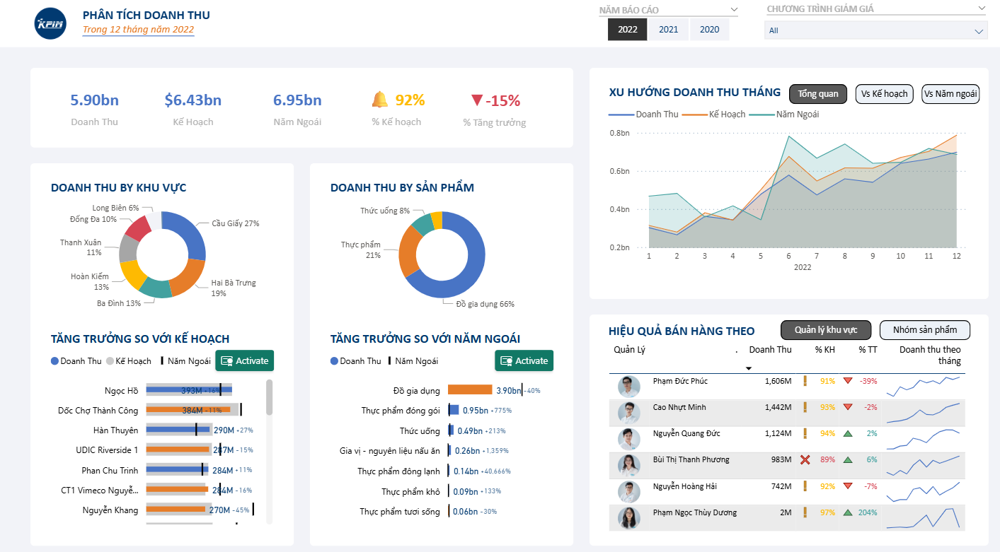

---

## Data set used
- **Revenue_Plan.xlsx**  
  Contains detailed data on revenue and product sales volume for the three years from 2020-2022.

- **kpim_mart_SQL_database:**

dim_customer

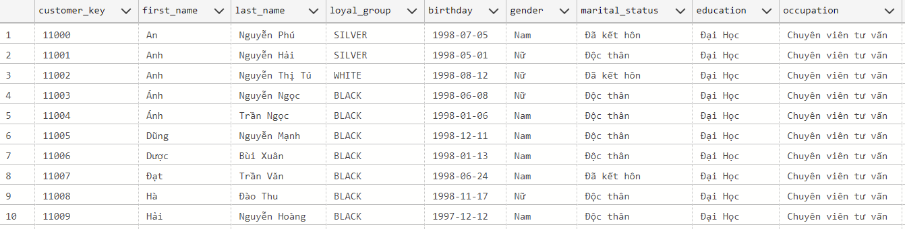

dim_date

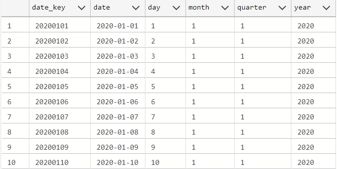

dim_product

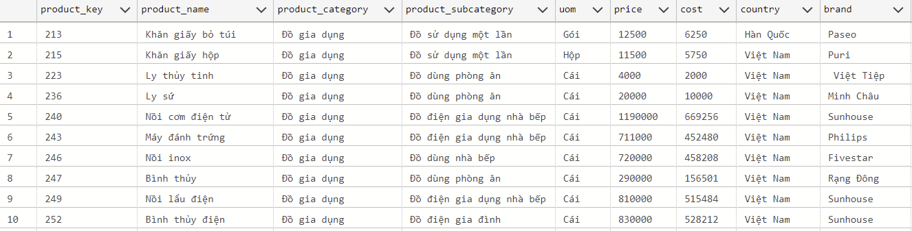

dim_promotion

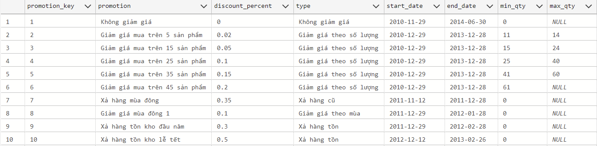

dim_store

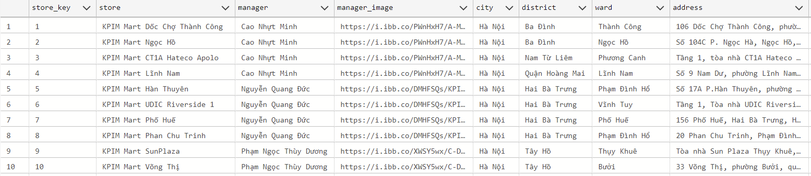

fact_sales

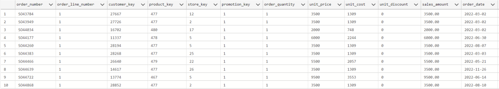

---

## Goals
- KPIs for Total Revenue Achieved vs. Total Revenue Planned (with alerts based on % Plan Completion Rate) over the same monitoring period.
- KPIs for Total Revenue Achieved vs. Total Revenue in the Same Period Last Year (with alerts based on % Growth compared to the previous year).
- Monitoring of Revenue Achieved vs. Planned by Manager/Area/Store and % plan completion rate for each entity.
- Comparison of Revenue Achieved vs. Revenue at the same time last year by Product/Product Group and % growth/decrease.
- Comparison of 12-month trends between Revenue Achieved vs. Planned Revenue and also with Revenue for that month last year.

---

## Project Description
1. Use Power Query to link data from the Revenue_Plan.xlsx file and also link it to the SQL database kpim_mart.

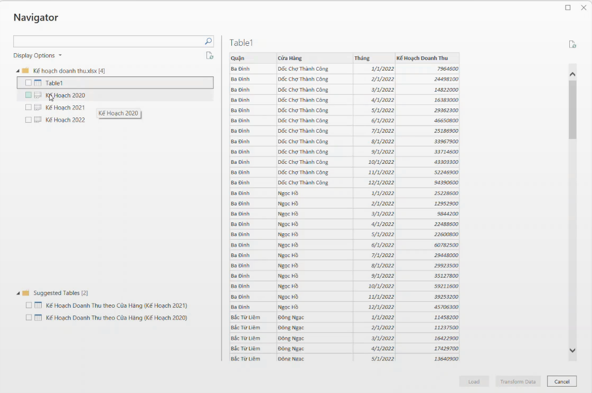
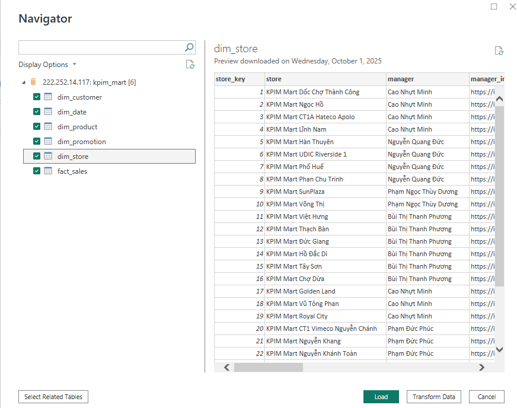

2. Link the tables together using Model View to create a schema model, helping to create a stronger connection between data from the tables, reducing data duplication and making writing and running DAX functions smoother.

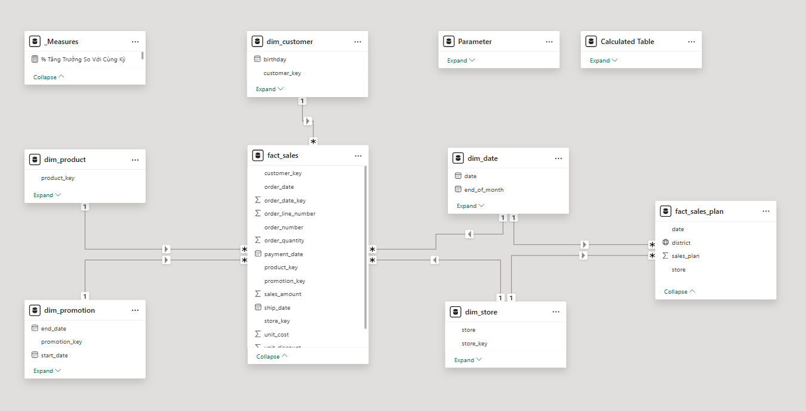

3. Calculate basic DAX functions such as revenue, planned revenue, and last year's revenue, along with text functions to show revenue progress against targets and compared to the previous year. Use the UNICHAR function to create simple icons to show the increase/decrease to easily visualize the growth rate, and these indicators will be displayed on the main indicators table.

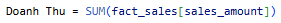  
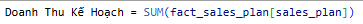
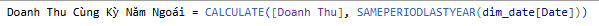
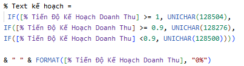
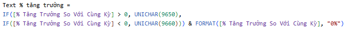
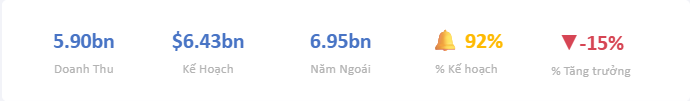

4. Create a line chart to visualize and compare actual revenue with planned revenue and last year's revenue over 12 months based on the selected year, and use the bookmark feature to create two more line charts comparing only actual revenue and last year's revenue. with the plan and compare the revenue of the selected year with the previous year.

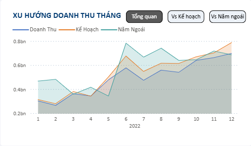  
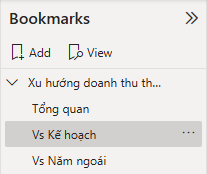  
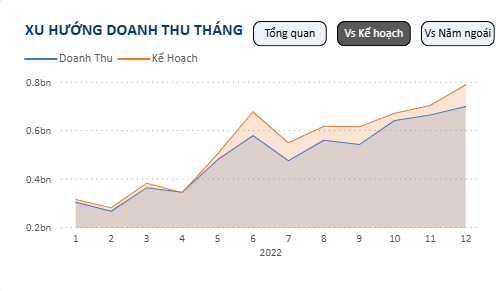  
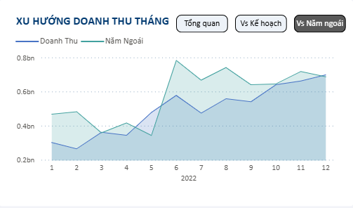

5. Create two pairs of Pie charts and Bullet charts (Bullet chart by OKVIZ) to show the percentage of revenue based on product groups or sales areas. The two pie charts will clearly show the percentage of revenue coming from which area or product group. In this project, revenue mainly comes from the Cau Giay and Hai Ba Trung areas, while the best-selling product is household goods.
The two bullet charts serve to compare actual revenue with planned revenue and with last year's revenue. In these bullet charts, columns with blue color mean that sales have been met or exceeded, orange means the opposite, and the black line on the column represents the revenue milestone of the previous year, giving us an overview and easy analysis.

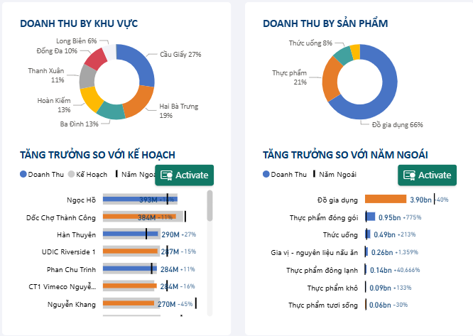
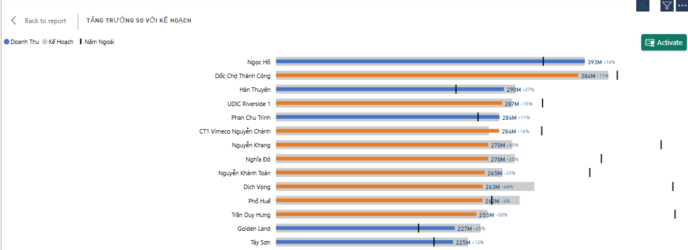

6. Calculate the dax function by dividing actual revenue by planned revenue to obtain the revenue plan progress. Do the same with actual revenue and last year's revenue to get the year-on-year growth rate. Create a table and link the manager's data, including images, revenue, growth rate, and planned progress, along with a spark line to easily visualize the managers' performance.
Use the bookmark feature to create another table with similar information to the manager's but instead of the type of product sold, to get a clearer view of the quantity and revenue growth rate of each product.

  
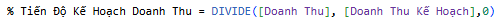  
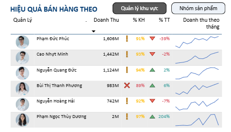
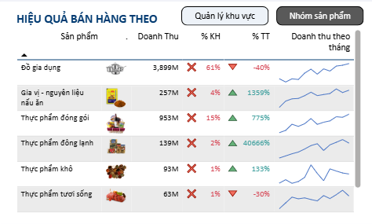

7. Finally, use the Slicer feature to create slicers to help us visualize and analyze sales and revenue data in more detail based on each year and promotion.

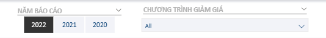

---

## Final Project

---
